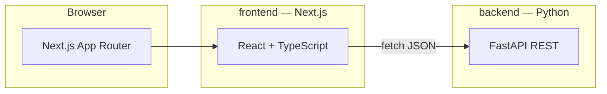

# Climate Risk Intelligence Platform — System Design

## Purpose

A small full-stack reference application with three interactive experiences: **login**, **business (institutional)** dashboard, and **consumer** dashboard. Visual language follows the provided reference screens (LoCal / ClimateHome).

## High-Level Architecture



- **frontend/**: **Next.js** (App Router, React, TypeScript) serves the UI. Demo auth uses **sessionStorage** in the browser (not production-grade).
- **backend/**: Python **FastAPI** exposes JSON APIs for health checks and demo analytics.

## Responsibilities

| Layer | Responsibility |
|--------|----------------|
| Next.js | Routing (`/login`, `/business`, `/consumer`), layouts, static CSS, client interactivity |
| FastAPI | Demo REST data (`/api/health`, `/api/summary/consumer`, `/api/summary/business`) |
| Session | `sessionStorage` after login; **both** `/business` and `/consumer` are available; login choice only sets the **first** screen |

## Security Note (Demo)

Login accepts **any non-empty credentials** and is **not** production authentication. Replace with proper auth (e.g. NextAuth, Clerk, or OIDC) before any real deployment.

## Ports

- Frontend (Next.js): `3000` (`npm run dev`)
- Backend (FastAPI): `8000`

Configure the UI’s API origin with **`NEXT_PUBLIC_API_BASE`** (see `frontend/.env.example`).

## Runbook

**Backend**

```bash
cd backend
python3 -m venv venv
source venv/bin/activate   # Windows: venv\Scripts\activate
pip install -r requirements.txt
uvicorn app.main:app --reload --port 8000
```

**Frontend**

```bash
cd frontend
cp .env.example .env.local   # optional; defaults to http://localhost:8000
npm install
npm run dev
```

Open `http://localhost:3000/login`. Choose **Business** or **Consumer**, enter any non-empty username and password.

**Production build**

```bash
cd frontend
npm run build
npm run start
```

## Repository Layout

```
SYSTEM_DESIGN.md
backend/
  app/main.py
  requirements.txt
  venv/                 # created locally, not committed
frontend/
  package.json
  src/app/              # App Router: page.tsx, login/, business/, consumer/
  src/components/
  src/lib/
```

## Future Extensions

- Wire dashboard cards to FastAPI with SWR or React Query.
- Add NextAuth (or similar) and server-side session or JWT.
- Role-based API access and real user records.
